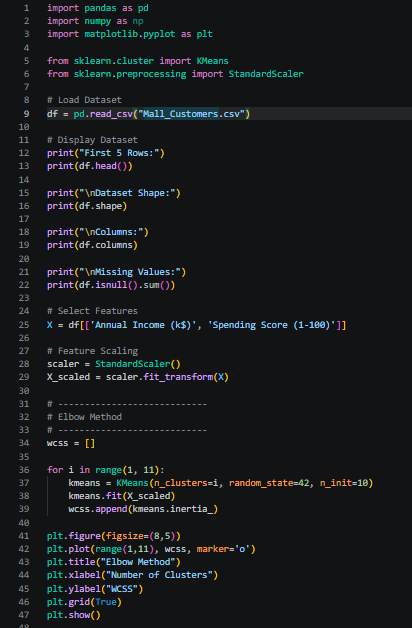
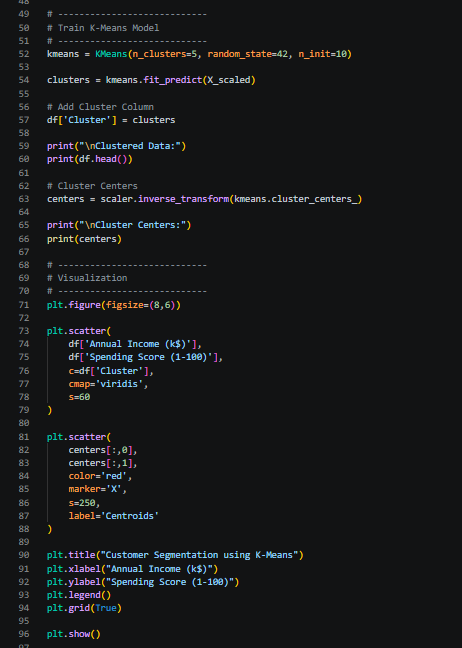
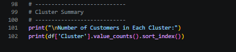
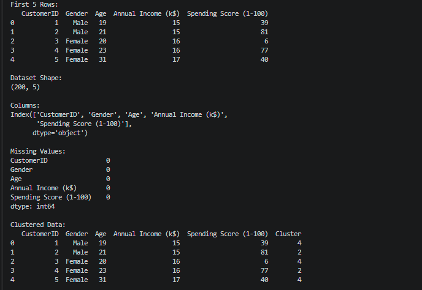
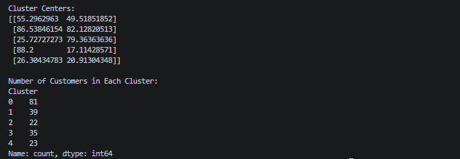
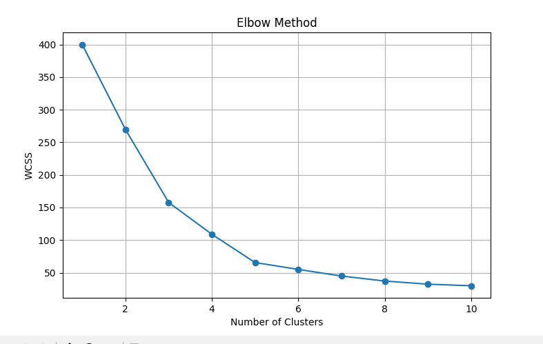
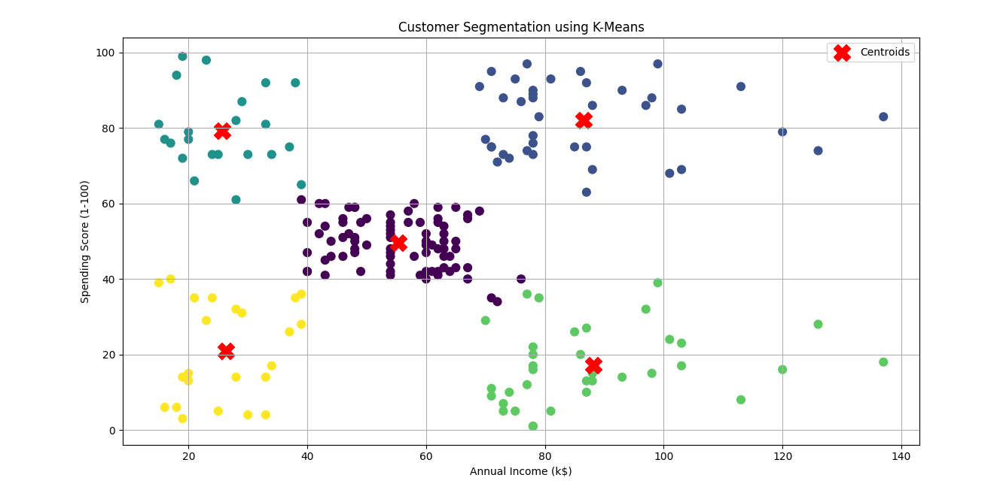

# 🛍️ Customer Segmentation using K-Means Clustering

## 📌 Project Overview

This project implements **K-Means Clustering**, an unsupervised machine learning algorithm, to segment mall customers based on their **Annual Income** and **Spending Score**.

Customer segmentation helps businesses understand customer behavior, identify target groups, and develop personalized marketing strategies.

---

## 🎯 Project Statement

Create a K-Means clustering algorithm to group customers of a retail store based on their purchase history.

---

## 🛠️ Technologies Used

- Python
- Pandas
- NumPy
- Matplotlib
- Scikit-learn
- VS Code

---

## 📂 Project Structure

```
SCT_ML_2/
│
├── Mall_Customers.csv
├── customer_segmentation.py
├── README.md
├── requirements.txt
└── images/
    ├── code1.png
    ├── code2.png
    ├── output1.png
    ├── output2.png
    ├── elbow_method.png
    └── customer_clusters.png
```

---

## 📊 Dataset

The project uses the **Mall Customers Dataset**, which contains customer information including:

- Customer ID
- Gender
- Age
- Annual Income (k$)
- Spending Score (1–100)

For clustering, the following features are used:

- Annual Income (k$)
- Spending Score (1–100)

---

## ⚙️ Workflow

The project follows these steps:

1. Import required libraries.
2. Load the Mall Customers dataset.
3. Perform basic data analysis.
4. Select relevant features.
5. Normalize the data using StandardScaler.
6. Determine the optimal number of clusters using the Elbow Method.
7. Train the K-Means clustering model.
8. Assign each customer to a cluster.
9. Display cluster centers.
10. Visualize customer segments and cluster centroids.
11. Display the number of customers in each cluster.

---

## 📈 Machine Learning Algorithm

**K-Means Clustering**

K-Means is an unsupervised learning algorithm that partitions the dataset into **K clusters** by minimizing the within-cluster sum of squares (WCSS).

Number of clusters used:

```
K = 5
```

---

## 📷 Project Screenshots

### Code







---

### Output

#### Dataset Information





#### Elbow Method



#### Customer Segmentation



---

## ▶️ How to Run the Project

### Clone the Repository

```bash
git clone https://github.com/nandithamuppalla/SCT_ML_2.git
```

### Navigate to the Project Folder

```bash
cd SCT_ML_2
```

### Install Required Libraries

```bash
pip install -r requirements.txt
```

### Run the Program

```bash
python customer_segmentation.py
```

---

## 📊 Output

The program displays:

- Dataset information
- Missing values
- Elbow Method graph
- Clustered customer dataset
- Cluster centers
- Number of customers in each cluster
- Customer Segmentation Scatter Plot

---

## 📈 Visualizations

The project generates the following graphs:

- Elbow Method (WCSS vs Number of Clusters)
- Customer Segmentation Scatter Plot
- Cluster Centroids

---

## 📦 Requirements

Install all required libraries using:

```bash
pip install -r requirements.txt
```

**requirements.txt**

```
numpy
pandas
matplotlib
scikit-learn
```

---

## 🎓 Learning Outcomes

- Data preprocessing
- Feature scaling using StandardScaler
- Understanding K-Means clustering
- Determining the optimal number of clusters using the Elbow Method
- Customer segmentation
- Data visualization using Matplotlib

---

## 👩‍💻 Author

**Muppalla Nanditha**

GitHub: https://github.com/nandithamuppalla

---

## 📜 License

This project is developed for educational and internship purposes under the SkillCraft Technology Machine Learning Internship.